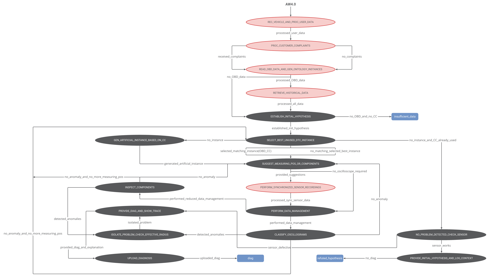
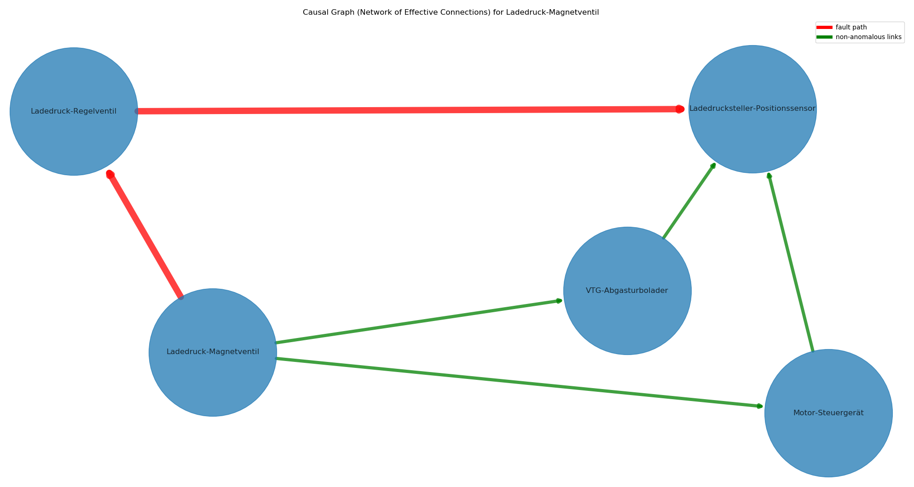

# Vehicle Diagnosis State Machine

State-machine-based prototype of a vehicle diagnosis *[and recommendation]* system.

## Dependencies

- [**standalone-smach**](https://pypi.org/project/standalone-smach/): ROS SMACH fork for development of HSM outside of ROS
- [**BeautifulSoup**](https://pypi.org/project/beautifulsoup4/): library that makes it easy to scrape information from web pages
- [**tensorflow**](https://pypi.org/project/tensorflow/): open source machine learning framework
- [**OBDOntology**](https://github.com/tbohne/OBDOntology): ontology for capturing knowledge about on-board diagnostics (OBD), particularly diagnostic trouble codes (DTCs) + ontology query tool
- [**oscillogram_classification**](https://github.com/tbohne/oscillogram_classification): neural network based anomaly detection for vehicle components using oscilloscope recordings
- [**CustomerXPS**](https://github.com/tbohne/CustomerXPS): expert system that deals with customer complaints
- [**py4j**](https://www.py4j.org/): bridge between Python and Java
- [**Apache Jena Fuseki**](https://jena.apache.org/documentation/fuseki2/): SPARQL server hosting / maintaining the knowledge graph
- [**networkx**](https://pypi.org/project/networkx/): Python package for creating and manipulating graphs and networks
- [**termcolor**](https://pypi.org/project/termcolor/): ANSI color formatting for output in terminal
- [**matplotlib**](https://matplotlib.org/): visualization with Python

## Installation (from source)

Install diagnosis state machine and dependencies:
```
$ git clone https://github.com/tbohne/vehicle_diag_smach.git
$ cd vehicle_diag_smach/
$ pip install .
```
Set up *Apache Jena Fuseki* server:
```
$ cd ..
$ curl -L https://dlcdn.apache.org/jena/binaries/apache-jena-fuseki-4.6.1.tar.gz > apache-jena-fuseki-4.6.1.tar.gz
$ tar -xvzf apache-jena-fuseki-4.6.1.tar.gz
$ chmod +x apache-jena-fuseki-4.6.1/fuseki-server
```
For configuration, i.e., hosting the knowledge graph, cf. [OBDOntology](https://github.com/tbohne/OBDOntology) (section "*Launch knowledge graph from `.owl` / `.ttl` file*").

## Installation (Docker)
```
$ git clone https://github.com/tbohne/vehicle_diag_smach.git
$ cd vehicle_diag_smach/
$ docker build -t diag_system -f docker/Dockerfile .
```

## Optional Installation of Customer XPS

Optionally, to use the customer XPS, create a `.jar` file with the *py4j* and *d3web* dependencies (cf. [CustomerXPS](https://github.com/tbohne/CustomerXPS)).

## Source Usage

Run server (knowledge graph) from *Apache Jena Fuseki* root directory (runs at `localhost:3030`):
```
$ ./apache-jena-fuseki-4.6.1/fuseki-server
```
Run state machine (in `vehicle_diag_smach/`):
```
$ python vehicle_diag_smach/high_level_smach.py
```
Optionally run customer XPS server (in `CustomerXPS/`):
```
$ java -jar out/artifacts/CustomerXPS_jar/CustomerXPS.jar
```

## Docker Usage

Allow local docker container to display visualizations on host system (connection to *XServer*):
```
$ xhost +local:docker
```
Run docker container with visualizations on host system (*Apache Jena Fuseki* server runs at `CONTAINER_IP:3030`):
```
$ docker run -v /tmp/.X11-unix/:/tmp/.X11-unix -e DISPLAY=unix$DISPLAY -ti diag_system
```
For configuration, i.e., hosting the knowledge graph, cf. [OBDOntology](https://github.com/tbohne/OBDOntology) (section "*Launch knowledge graph from `.owl` / `.ttl` file*").

Optionally run customer XPS server (in `CustomerXPS/`):
```
$ java -jar out/artifacts/CustomerXPS_jar/CustomerXPS.jar
```

## State Machine Architecture


## Fault Isolation Result Example

