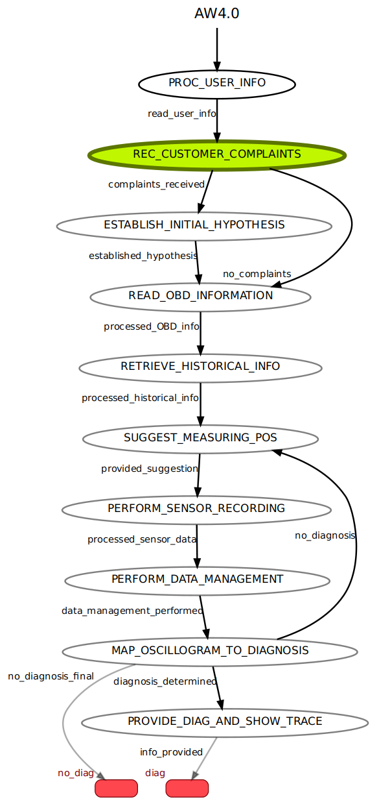

# AW4.0 Prototype

State-machine-based prototype of a vehicle diagnosis *[and recommendation]* system.

## Dependencies

- [**standalone-smach**](https://pypi.org/project/standalone-smach/): ROS SMACH fork for development of HSM outside of ROS
- [**AW_40_GUI**](https://github.com/DanielNowak98/AW_40_GUI):  GUI for parsing OBD data and vehicle meta information
- [**BeautifulSoup**](https://pypi.org/project/beautifulsoup4/): library that makes it easy to scrape information from web pages
- [**OBDOntology**](https://github.com/tbohne/OBDOntology): ontology for capturing knowledge about on-board diagnostics (OBD), particularly diagnostic trouble codes (DTCs) + ontology query tool

## State Machine Architecture

