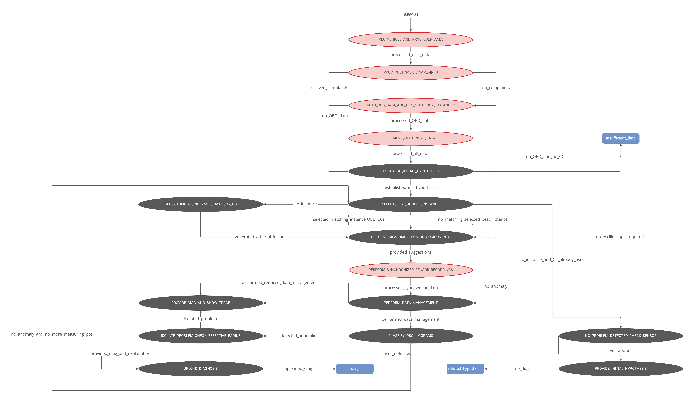

# Vehicle Diagnosis State Machine

State-machine-based prototype of a vehicle diagnosis *[and recommendation]* system.

## Dependencies

- [**standalone-smach**](https://pypi.org/project/standalone-smach/): ROS SMACH fork for development of HSM outside of ROS
- [**AW_40_GUI**](https://github.com/DanielNowak98/AW_40_GUI): GUI for parsing OBD data and vehicle meta information
- [**BeautifulSoup**](https://pypi.org/project/beautifulsoup4/): library that makes it easy to scrape information from web pages
- [**tensorflow**](https://pypi.org/project/tensorflow/): open source machine learning framework
- [**OBDOntology**](https://github.com/tbohne/OBDOntology): ontology for capturing knowledge about on-board diagnostics (OBD), particularly diagnostic trouble codes (DTCs) + ontology query tool
- [**oscillogram_classification**](https://github.com/tbohne/oscillogram_classification): neural network based anomaly detection for vehicle components using oscilloscope recordings

## Installation

```
$ mkdir diag
$ cd diag
$ git clone https://github.com/tbohne/AW_40_GUI.git
$ git clone https://github.com/tbohne/OBDOntology.git
$ git clone https://github.com/tbohne/oscillogram_classification.git
$ touch __init__.py setup.py
```
Open `setup.py` and enter the following:
```
from setuptools import setup, find_packages
setup(
    name='diag',
    packages=find_packages(),
)
```
Install:
```
$ python setup.py install
```

## Usage

```
$ python vehicle_diag_smach/high_level_smach.py
```

## State Machine Architecture


