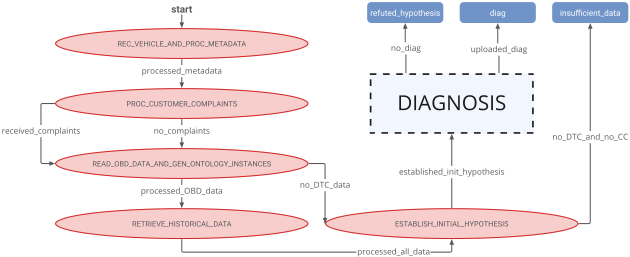
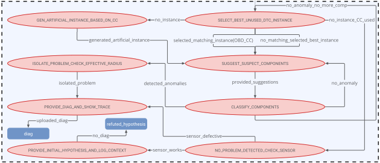
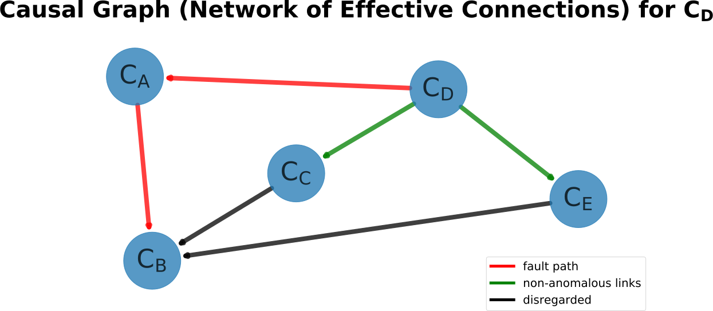

# Neuro-Symbolic Vehicle Diagnosis State Machine

> Iterative, hybrid neuro-symbolic approach for anomaly detection and complex fault diagnosis, enabling knowledge-based (symbolic) methods to complement (neural) machine learning methods and vice versa. Explainability is indispensable for diagnosis and arises naturally in the system through the specific interplay of neural and symbolic methods. The reasoning of the system is encoded in a state machine architecture.

## Neuro-Symbolic Architecture

Essentially, the *Diag. Circuit* is implemented through this repository, the *Neural Network Architectures* through [**oscillogram_classification**](https://github.com/tbohne/oscillogram_classification), and the *Knowledge Graph* through [**obd_ontology**](https://github.com/tbohne/obd_ontology).


## Dependencies

- for Python requirements, cf. `requirements.txt`
- [**Apache Jena Fuseki**](https://jena.apache.org/documentation/fuseki2/): SPARQL server hosting / maintaining the knowledge graph
- optional: *[**CustomerXPS**](https://github.com/tbohne/CustomerXPS): expert system that deals with customer complaints*

## Installation (from source)

Install diagnosis state machine and dependencies:
```
$ git clone https://github.com/tbohne/vehicle_diag_smach.git
$ cd vehicle_diag_smach/
$ pip install .
```
Set up *Apache Jena Fuseki* server:
```
$ cd ..
$ curl -L https://dlcdn.apache.org/jena/binaries/apache-jena-fuseki-4.6.1.tar.gz > apache-jena-fuseki-4.6.1.tar.gz
$ tar -xvzf apache-jena-fuseki-4.6.1.tar.gz
$ chmod +x apache-jena-fuseki-4.6.1/fuseki-server
```
For configuration, i.e., hosting the knowledge graph, cf. [obd_ontology](https://github.com/tbohne/obd_ontology) (section "*Launch knowledge graph from `.owl` / `.ttl` file*").

## Installation (Docker)
```
$ git clone https://github.com/tbohne/vehicle_diag_smach.git
$ cd vehicle_diag_smach/
$ docker build -t diag_system -f docker/Dockerfile .
```

## Optional Installation of Customer XPS

Optionally, to use the customer XPS, create a `.jar` file with the *py4j* and *d3web* dependencies (cf. [CustomerXPS](https://github.com/tbohne/CustomerXPS)).

## Source Usage

Run server (knowledge graph) from *Apache Jena Fuseki* root directory (runs at `localhost:3030`):
```
$ ./apache-jena-fuseki-4.6.1/fuseki-server
```
Run state machine (in `vehicle_diag_smach/`):
```
$ python vehicle_diag_smach/high_level_smach.py
```
Optionally run customer XPS server (in `CustomerXPS/`):
```
$ java -jar out/artifacts/CustomerXPS_jar/CustomerXPS.jar
```

## Docker Usage

### <u>Initial run (only for initial setup)</u>

Allow local docker container to display visualizations on host system (connection to *XServer*):
```
$ xhost +local:docker
```
Create and start docker container with visualizations on host system (*Apache Jena Fuseki* server runs at `CONTAINER_IP:3030`):
```
$ docker run -v /tmp/.X11-unix/:/tmp/.X11-unix -e DISPLAY=unix$DISPLAY -ti diag_system
```
For configuration, i.e., hosting the knowledge graph, cf. [obd_ontology](https://github.com/tbohne/obd_ontology) (section "*Launch knowledge graph from `.owl` / `.ttl` file*").

### <u>Run existing container</u>

After restarts, repeat the above *XServer* settings if necessary.  Start already existing container (with persistent knowledge graph hosted on `CONTAINER_IP:3030`):
```
$ docker start -i CONTAINER_ID
```

Optionally run customer XPS server (in `CustomerXPS/`):
```
$ java -jar out/artifacts/CustomerXPS_jar/CustomerXPS.jar
```

## State Machine Architecture

**Hierarchical Diagnosis State Machine (High-Level)**


**Embedded Diagnosis State Machine (Low-Level)**


## Fault Isolation Result Example


## Paper Reference

TBD.
